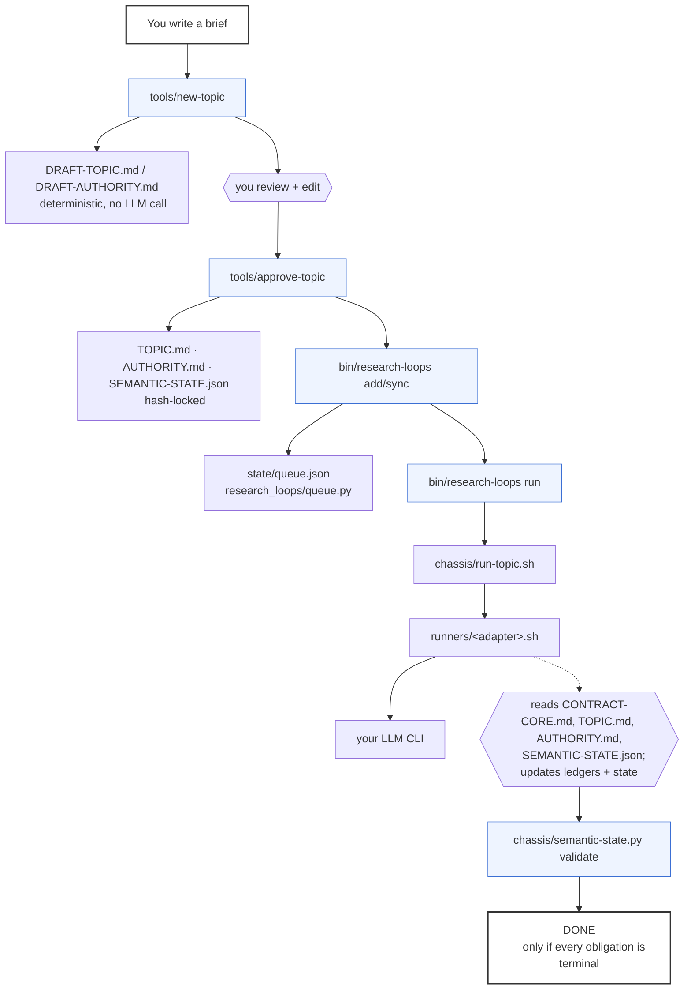

# research-loops

**A durable engine for running autonomous research topics to genuine completion.**

Not a fixed iteration count, not a token budget — an actual executable check that every
question you asked has a real answer, or an honest "unresolved, and here's why."

`v0.1.0` · Apache-2.0 · Python 3.12+ · zero third-party dependencies · 133 tests passing

---

You bring an LLM CLI you already have access to and a short brief describing what you
want researched. This engine handles the rest: queueing, crash-safe retry, liveness
detection, and a completion gate that a research agent cannot talk its way past.

**What this is not:** a RAG stack, a search engine, or an agent framework. It doesn't
ship a vector database or a knowledge graph, and it doesn't need one — a topic's local
markdown ledgers are always its evidence of record. Bring your own retrieval if you want
richer infrastructure; the default path needs nothing but a runner CLI and Python 3.12+.

## Why this exists

Most "agent does research" demos either stop when the model feels like stopping, or run
forever accumulating sources without ever answering the actual question. Neither is
research — the first quits early, the second never quits. This engine forces a third
option: research ends when every question you defined up front has a real, checkable,
evidence-graded disposition, decided by a validator, not by the agent's own say-so.

That disposition is `supported`, `contradicted`, `unresolved`, or `deferred` — never a
verdict. The engine's job is to collect and grade evidence thoroughly enough that a
human (or a downstream process) can actually decide the real question — which library
to use, how to architect something, what the answer is — not to hand down that decision
itself. See [`docs/governance.md`](docs/governance.md#the-output-is-evidence-not-a-verdict).

- **Completion is executable, not asserted.** `semantic-state.py validate` either passes
  or it doesn't; a research agent writing `STOP DONE` while obligations remain open gets
  overruled by the queue, every time.
- **Liveness and completion are different questions.** A topic that stops making real
  progress gets flagged for a human — it never gets silently marked finished just
  because nothing changed.
- **Scope is yours, not the agent's.** An agent can propose a gap it found; only you can
  turn that proposal into binding scope.
- **Nothing required beyond a runner CLI.** No mandatory vector database, no mandatory
  graph store, no mandatory external gateway. A topic's own markdown ledgers are always
  its evidence of record.

## The idea in one paragraph

A **topic** is a finite, operator-approved list of obligations ("what must this
research establish") plus a small set of required deliverables. A **runner** (Claude
Code, Codex, Hermes, or anything else you point it at) does one bounded research
iteration at a time: read the topic, pick the highest-value open obligation, verify
evidence, update the topic's own state file. A **queue** schedules iterations across
however many topics and workers you're running, survives crashes, and classifies
failures correctly (a subscription quota window is not the same problem as a broken
config). None of these three pieces know about the other two's internals — swap any of
them independently.



## Quickstart

```bash
git clone <this-repo> research-loops && cd research-loops
python3 -m venv .venv && . .venv/bin/activate   # optional, no dependencies to install

# 1. Describe what you want researched
cat > /tmp/brief.md <<'EOF'
Research how to choose a static site generator for a personal blog under 50 posts.
Cover build speed and DX for Hugo, Eleventy, Astro, and Zola; hosting friction on
GitHub Pages, Netlify, and Cloudflare Pages; and migration cost if I later add a
little client-side interactivity. Exclude full SPA frameworks like Next.js.
EOF

# 2. Turn it into a draft topic (deterministic, no LLM call yet)
tools/new-topic my-first-topic --title "My First Topic" --brief /tmp/brief.md

# 3. Read topics/my-first-topic/DRAFT-*.md, edit anything you want, then:
tools/approve-topic my-first-topic

# 4. Queue it and run one bounded iteration with a real runner
bin/research-loops add --id my-first-topic --title "My First Topic" \
  --cwd "$(pwd)/topics/my-first-topic" --stop-file STOP \
  --max-attempts 8 --repeat-seconds 900 -- \
  "$(pwd)/chassis/run-topic.sh" "$(pwd)/topics/my-first-topic" claude
bin/research-loops run --once

# 5. Check status any time
bin/research-loops dashboard --output STATUS.md && cat STATUS.md
```

`claude` above is just one choice — swap the last positional argument for `codex`,
`hermes`, or `generic` (see [`runners/README.md`](runners/README.md)) depending on
which CLI you already have authenticated.

Want to skip straight to a real run? `examples/static-site-generator-choice/` is a
fully approved, never-run topic — no brief-writing needed:

```bash
bin/research-loops add --id static-site-generator-choice \
  --title "Static Site Generator Choice for a Personal Blog" \
  --cwd "$(pwd)/examples/static-site-generator-choice" --stop-file STOP \
  --max-attempts 8 --repeat-seconds 900 -- \
  "$(pwd)/chassis/run-topic.sh" "$(pwd)/examples/static-site-generator-choice" claude
bin/research-loops run --once
```

## Layout

| Path | What |
|---|---|
| `research_loops/` | the queue engine: atomic state, crash-safe claim/retry, failure classification, dashboard |
| `chassis/` | the per-iteration contract every topic runs under (`CONTRACT-CORE.md`, `run-topic.sh`, the completion validator) |
| `runners/` | adapters translating the Agent Runner contract to a specific CLI (Claude Code, Codex, Hermes, or your own) |
| `tools/` | `new-topic` and `approve-topic` — brief in, reviewed hash-locked topic out |
| `templates/topic/` | the three-file shape (`TOPIC.md`, `AUTHORITY.md`, `SEMANTIC-STATE.json`) if you'd rather write one by hand |
| `schema/` | JSON Schema for `SEMANTIC-STATE.json` |
| `examples/` | one real, runnable, fully-approved topic |
| `docs/` | architecture, topic authoring, and operations detail |

## Documentation

- [`docs/architecture.md`](docs/architecture.md) — the three layers, the state machine, why liveness ≠ completion
- [`docs/topic-authoring.md`](docs/topic-authoring.md) — the full topic contract, dependencies, and how to change scope safely
- [`runners/README.md`](runners/README.md) — the Agent Runner interface and how to add a new adapter
- [`docs/operations.md`](docs/operations.md) — running multiple workers, systemd deployment, troubleshooting
- [`docs/governance.md`](docs/governance.md) — why the operator owns scope, and why quota failure is never evidence of absence

## Development

```bash
PYTHONPATH=. python3 -m unittest discover -s tests -p 'test_*.py'
```

No dependencies to install for that — the engine is pure standard library. See
[`CONTRIBUTING.md`](CONTRIBUTING.md) for how to add a runner adapter, propose a change,
or report an issue with a specific topic's obligation decomposition.

## License

Apache License 2.0 — see [`LICENSE`](LICENSE) and [`NOTICE`](NOTICE). Research output
your topics produce is yours; this license covers the engine, not what it finds.
